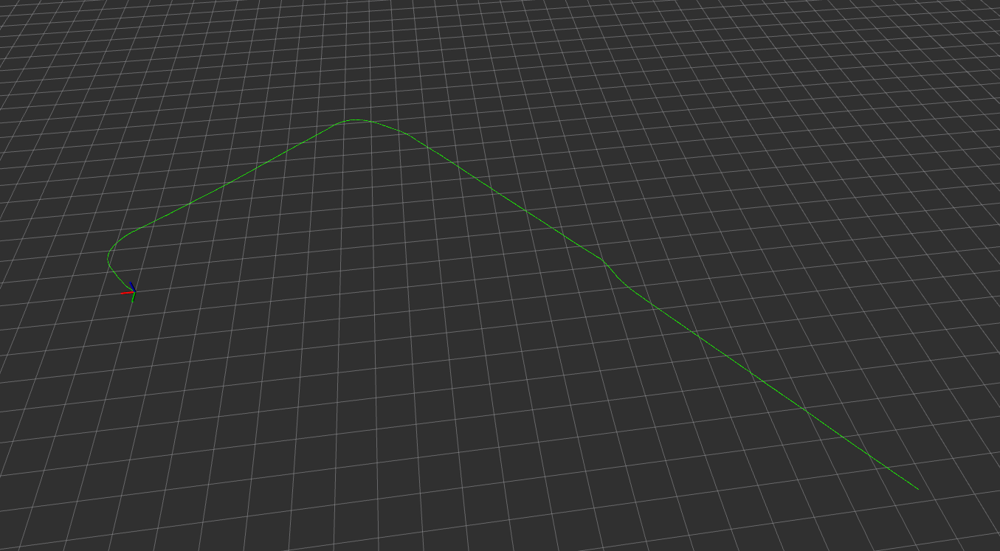
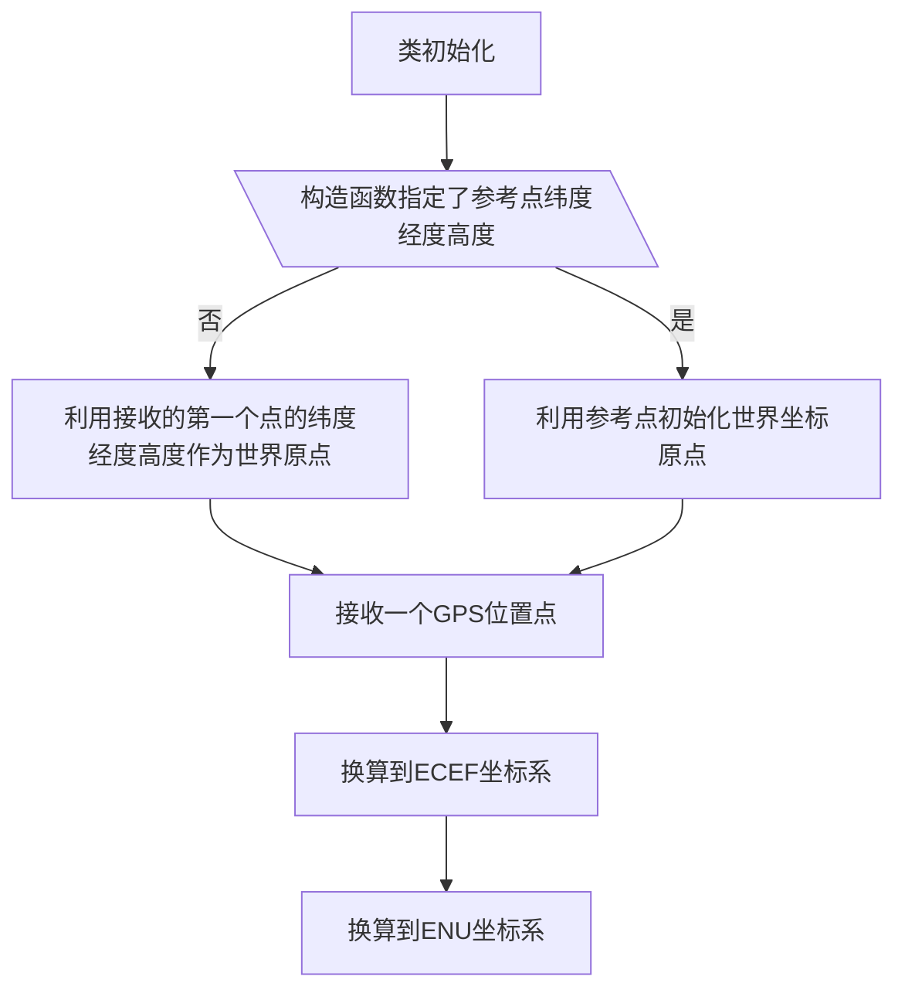

# 介绍

本包提供了一个GPS轨迹转换到ENU坐标系下并可视轨迹的功能。

## 基本流程

现在的方法为
$P_{LLA} \rightarrow P_{ECEF} \rightarrow P_{ENU}$

### 基本思路

## 转换关系公式

### 几个坐标系

- LLA：GPS用的纬度(latitude),经度(longitude), 海拔(altitude)

- ECEF: 地心地固坐标系
- ENU：东北天坐标系

### 纬经高转ECEF坐标系

一个点的LLA为纬度、经度、高度分别为 $\lambda ,\varphi ,h$ ，这个点在ECEF坐标系下的位置为：

$$\begin{aligned}
\mathrm{x} & =\left(\mathrm{R}_{\mathrm{N}}+\mathrm{h}\right) \cos \phi \cos \lambda \\
\mathrm{y} & =\left(\mathrm{R}_{\mathrm{N}}+\mathrm{h}\right) \cos \phi \sin \lambda \\
\mathrm{z} & =\left(\left[1-\mathrm{e}^2\right] \mathrm{R}_{\mathrm{N}}+\mathrm{h}\right) \sin \phi
\end{aligned}$$
其中
$$N(\phi)=\frac{a^2}{\sqrt{a^2 \cos ^2 \phi+b^2 \sin ^2 \phi}}=\frac{a}{\sqrt{1-e^2 \sin ^2 \phi}}$$

- a: 地球长半轴长度
- e: 椭圆扁率

参考：[一些坐标系的换算关系](https://en.wikipedia.org/wiki/Geographic_coordinate_conversion)

### ECEF转ENU

已知：

​ 待换算点ECEF坐标为  $P=(x,y,z)$，选定参考点的ECEF位置为 $P_0=(x_0,y_0,z_0)$ ，参考点的纬度和经度分别为  $\varphi$ 和 $\lambda$ 。P点在ENU坐标系下的位置为：
$$P_{ENU}=R(P-P_0)$$

其中R的具体计算方法为：

$$R=
\left (
\begin{array}{ccc}
-\sin \lambda&-\cos \lambda \sin \varphi&\cos \lambda \cos \varphi\\
\cos \lambda&-\sin \lambda \sin & \sin \lambda \cos \varphi\\
0& \cos \varphi & \sin \varphi\\
\end{array}
\right )$$

参考：[Transformations between ECEF and ENU coordinates](https://gssc.esa.int/navipedia/index.php/Transformations_between_ECEF_and_ENU_coordinates)

### LLA直接转ENU

利用椭球的微分近似关系，有这个公式，计算量更小但是是不是会有精度损失呢？ 

$$\left(\begin{array}{c}
d E \\
d N \\
d U
\end{array}\right)=\left(\begin{array}{ccc}
(N(\phi)+h) \cos \phi & 0 & 0 \\
0 & M(\phi)+h & 0 \\
0 & 0 & 1
\end{array}\right)\left(\begin{array}{l}
d \lambda \\
d \phi \\
d h
\end{array}\right)$$

其中 $$M(\phi)=\frac{a\left(1-e^2\right)}{\left(1-e^2 \sin ^2 \phi\right)^{\frac{3}{2}}}$$
